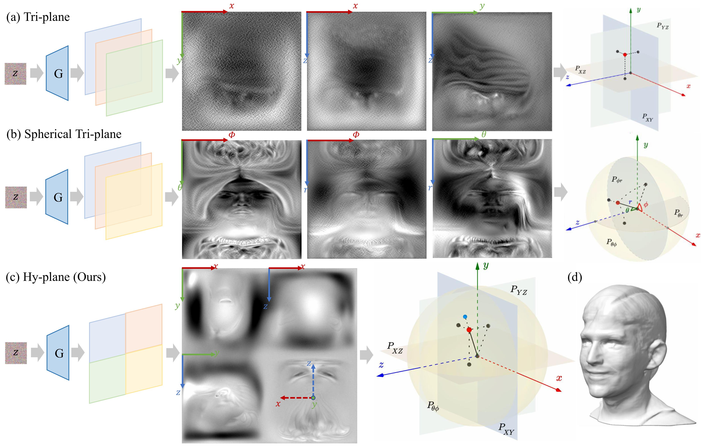

# HyPlaneHead: Rethinking Tri-plane-like Representations in Full-Head Image Synthesis

[](https://arxiv.org/abs/2509.16748)
[](https://creativecommons.org/licenses/by/4.0)
[](https://lhyfst.github.io/hyplanehead/)

**Authors:** [Heyuan Li](https://lhyfst.github.io/)*, [Kenkun Liu](https://kenkunliu.github.io/PersonalPage/), [Lingteng Qiu](https://lingtengqiu.github.io/)†, Qi Zuo, Keru Zheng, Zilong Dong, [Xiaoguang Han](https://mypage.cuhk.edu.cn/academics/hanxiaoguang/)

\* Work done during an internship at Tongyi Lab.   †Team lead.



## Abstract

Tri-plane-like representations have been widely adopted in 3D-aware GANs for head image synthesis and other 3D object/scene modeling tasks due to their efficiency. However, querying features via Cartesian coordinate projection often leads to feature entanglement, which results in mirroring artifacts. A recent work, SphereHead, attempted to address this issue by introducing spherical tri-planes based on a spherical coordinate system. While it successfully mitigates feature entanglement, SphereHead suffers from uneven mapping between the square feature maps and the spherical planes, leading to inefficient feature map utilization during rendering and difficulties in generating fine image details. Moreover, both tri-plane and spherical tri-plane representations share a subtle yet persistent issue: feature penetration across convolutional channels can cause interference between planes, particularly when one plane dominates the others. These challenges collectively prevent tri-plane-based methods from reaching their full potential. In this paper, we systematically analyze these problems for the first time and propose innovative solutions to address them. Specifically, we introduce a novel hybrid-plane (hy-plane for short) representation that combines the strengths of both planar and spherical planes while avoiding their respective drawbacks. We further enhance the spherical plane by replacing the conventional theta-phi warping with a novel near-equal-area warping strategy, which maximizes the effective utilization of the square feature map. In addition, our generator synthesizes a single-channel unified feature map instead of multiple feature maps in separate channels, thereby effectively eliminating feature penetration. With a series of technical improvements, our hy-plane representation enables our method, HyPlaneHead, to achieve state-of-the-art performance in full-head image synthesis.

---

## Requirements

* Linux recommended for optimal performance and compatibility.
* 1&ndash;8 high-end NVIDIA GPUs. We have done all testing and development using A10, V100, and H20 GPUs.
* 64-bit Python 3.8 and PyTorch 1.11.0 (or later). See https://pytorch.org for PyTorch install instructions.
* Python libraries: see [environment.yml](./environment.yml) for exact dependencies.

**Environment setup (Miniconda3):**

```bash
cd HyPlaneHead
conda env create -f environment.yml
conda activate hyplanehead
```


## Getting Started

1. Download the pre-trained checkpoint from [OSS_Link](https://virutalbuy-public.oss-cn-hangzhou.aliyuncs.com/share/aigc3d/data/for_lingteng/checkpoints/nips2025/hyplanehead/hyplanehead-ckpt.pkl) and place it under the `model` directory.
2. Pre-trained networks are stored as `*.pkl` files that can be referenced using local filenames.

## Generating Samples

```bash
# Generate images and shapes (as .mrc files) using pre-trained model
python gen_samples.py --trunc=0.7 --seeds=0-2 --network model/hyplanehead-ckpt.pkl --outdir=output
```


## Citation

If you find our work helpful, please cite our paper:

```
@article{li2025hyplanehead,
  title={HyPlaneHead: Rethinking Tri-plane-like Representations in Full-Head Image Synthesis},
  author={Li, Heyuan and Liu, Kenkun and Qiu, Lingteng and Zuo, Qi and Zheng, Keru and Dong, Zilong and Han, Xiaoguang},
  journal={arXiv preprint arXiv:2509.16748},
  year={2025}
}
```

## Acknowledgements

This repository is built upon [NVlabs/eg3d](https://github.com/NVlabs/eg3d) and [SizheAn/PanoHead](https://github.com/SizheAn/PanoHead). We thank the authors for their excellent contributions.

---

## 🚀 Follow-up Work: BalanceHead (ICLR 2026)

We are excited to introduce our follow-up work, **BalanceHead**, which addresses the deep-rooted issue of **directional bias** in 3D-aware GANs. By overcoming this challenge, it **unleashes the latent diversity** of the generative model, achieving true generalization in full-head synthesis.

**Condition Matters in Full-head 3D GANs**  
*[Heyuan Li](https://lhyfst.github.io/), Huimin Zhang, Yuda Qiu, Zhengwentai Sun, Keru Zheng, [Lingteng Qiu](https://lingtengqiu.github.io/)†, Peihao Li, Qi Zuo, Ce Chen, Yujian Zheng, Yuming Gu, Zilong Dong, [Xiaoguang Han](https://mypage.cuhk.edu.cn/academics/hanxiaoguang/)*  
† Team lead.

[**[Project Page]**](https://lhyfst.github.io/balancehead/) | [**[Paper]**](https://arxiv.org/abs/2602.07198)

```bibtex
@article{li2026condition,
  title={Condition Matters in Full-head 3D GANs},
  author={Li, Heyuan and Zhang, Huimin and Qiu, Yuda and Sun, Zhengwentai and Zheng, Keru and Qiu, Lingteng† and Li, Peihao and Zuo, Qi and Chen, Ce and Zheng, Yujian and others},
  journal={arXiv preprint arXiv:2602.07198},
  year={2026}
}
